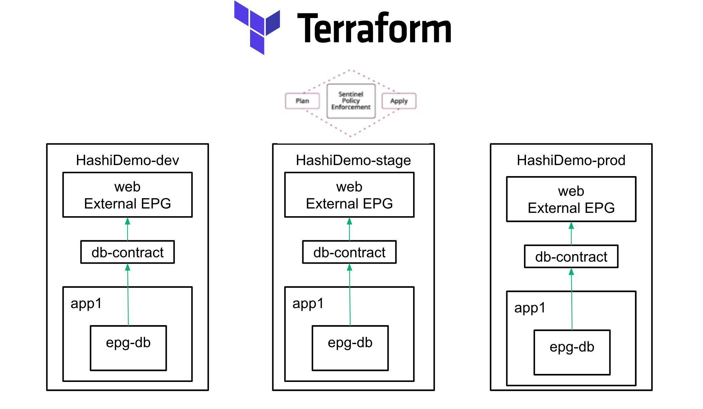
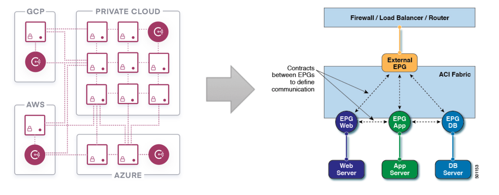

# consul-cisco-network-automation

Proof of concept demo for showing how Terraform and Consul can be used to automate network changes associated with the following Cisco Equipment

* Cisco Application Centric Infrastructure
* Cisco Nexus 9000 Series Data Center switches.

## Scenario

An application team is developing a cloud-native web application, which needs to make calls to a backend system of record hosted inside a
Cisco ACI fabric. This requires synchronizing information between the highly dynamic web application, which scales horizontally during peak hours, and shrinks during off-peak hours with network elements that control access between these systems.

Consul is a common tool used by cloud-native applications to provide service registry, service discovery, and service mesh capabilities. The service registry can be seen as a **source of truth** that can be used as input to other network automation activities.

This POC will demonstrate this scenario in two key areas:

#### 1. Provisioning


Terraform provides developers and operators a standard way to produce and consume Infrastructure
resources.  Cisco ACI provides a multi-tenant SDN fabric, which allows organizations to use the tenant construct for
the application lifecycle of their current deployment, a standard example of how tenants might be used.
* a tenant for the resources that developers use to build the application
* a tenant for staging environment where testing of the application is performed
* a tenant for an the production application.

### 2. Synchronization of service information.



The Consul service registry can be used as a source of truth to feed real-time service information into network equipment in multiple locations.

* Updating an object-group on Nexus 9000 switches.  Object groups are commonly used to make managing things like ACL's and QoS policies.  
These are largely managed manually, and are error-prone for two reasons:
	1. generally managed manually
	2. Garbage in, garbage out! Where's my source of truth? Is it accurate? Is the rate of churn increasing?

* Updating an External EPG with service information.  This EPG can be configured to provide or consume contracts within the ACI fabric.


# Setup/Provisioning

This code in this repo can be used to quickly launch the demo environment.


Terraform can be used to provision ACI resources in an Infrastructure-As-Code operational
model.  Let's create a few resources to get us started.

```
git clone https://github.com/kecorbin/consul-cisco-network-automation
cd consul-cisco-network-automation
cd terraform
terraform init
terraform plan
terraform apply --auto-approve

```

Docker Compose gives us a low toil way to launch the demo environment.  The file describes
a sample environment made up of a consul cluster, and three "web" nodes. Consul can provide
L7 based routing, simple round robin load balancing, canary deployments, or
disaster recovery solutions. But for now, let's see what it can do in a "crawl phase"

```
cd ..
docker-compose build
docker-compose up
```

You can verify the status of the demo environment by accessing the consul UI at
http://localhost:8500/ui/dc1/nodes


# Cisco Environment Details

This POC leverages the Nexus 9K and ACI Always-On Sandbox provided by Cisco DevNet.  

## Montior Nexus 9000 Object Groups
You can access the Nexus 9000 we are using by connecting to the following device

```
ssh admin@sbx-nxos-mgmt.cisco.com -p 8181
```

Credentials are `admin/Admin_1234!`


The object groups can be monitored using the `show object-group` command
```
sbx-n9kv-ao# show object-group
IPv4 address object-group web_servers
	10 host 172.28.0.5
	20 host 172.28.0.3
	30 host 172.28.0.4

```

## Monitor ACI Fabric

The always on ACI sandbox is available at: https://sandboxapicdc.cisco.com/

Credentials are `admin/ciscopsdt`

# Profit!

Try exploring things like `docker-compose stop web3` and observe the object groups and external EPG's reacting.
